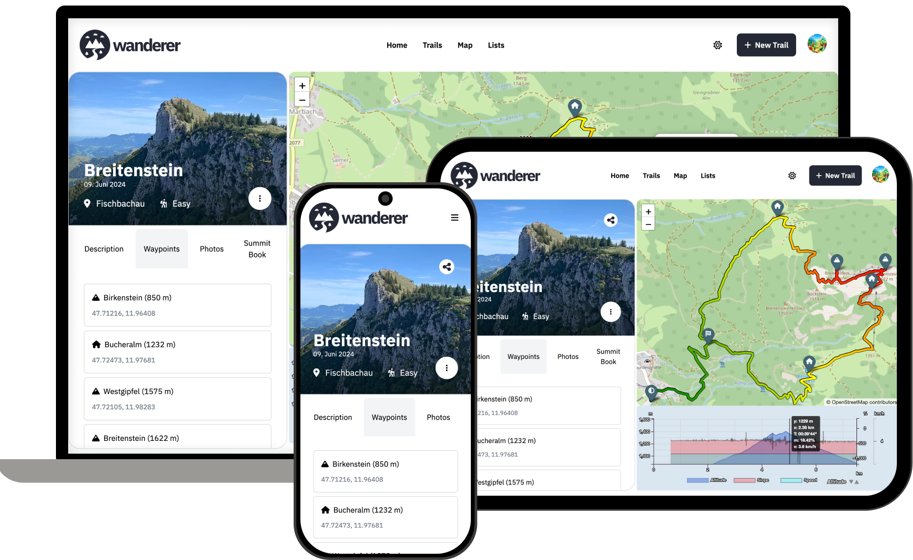

<div align="center">

  

  <h4>The trail catalogue that makes your GPS data searchable</h4>

[](https://github.com/Flomp/wanderer/)
[](https://github.com/Flomp/wanderer/)
[](https://www.buymeacoffee.com/wanderertrails)
[](https://discord.gg/USSEBY98CP)

[](https://demo.wanderer.to)

</div>

wanderer is a self-hosted trail database. You can upload your recorded tracks or create new ones and add various metadata to build an easily searchable catalogue. 

## Core Features



- Manage your trails
- Plan new routes
- Extensive map integration and visualization
- Share trails with other people and explore theirs
- Advanced filter and search functionality
- Create custom lists to organize your trails further


## Getting started
The recommended and quickest way to install wanderer is using docker compose:

``` bash
# download the docker compose file
wget https://raw.githubusercontent.com/Flomp/wanderer/main/docker-compose.yml

# build and launch via docker compose
docker compose up -d
```

The first startup can take up to 90 seconds after which you can access the frontend at localhost:3000.

> ℹ️ if you are not hosting wanderer at http://localhost:3000 make sure to change ORIGIN variable. Otherwise you will run into CORS errors.

> ⚠️ if you are using wanderer in a production environment make sure to change the MEILI_MASTER_KEY variable.

You can also run wanderer on bare-metal. Check out the [documentation](https://wanderer.to/getting-started/installation/#from-source) for a detailed how-to guide.

## Support wanderer

If you like wanderer and would like to give something back you can donate over [here](https://www.buymeacoffee.com/wanderertrails).

## Documentation

Please check the [website](https://wanderer.to) for the complete documentation.

## Contributing

Help is welcome at any time. If you are not sure where you can start check the [roadmap](https://github.com/users/Flomp/projects/2/views/1) for features in the backlog.
If you would like to contribute a translation, you can do so [here](https://crowdin.com/project/wanderer).

## License
This project is licensed under the AGPLv3 License. See the [LICENSE](LICENSE) file for the full license text.
