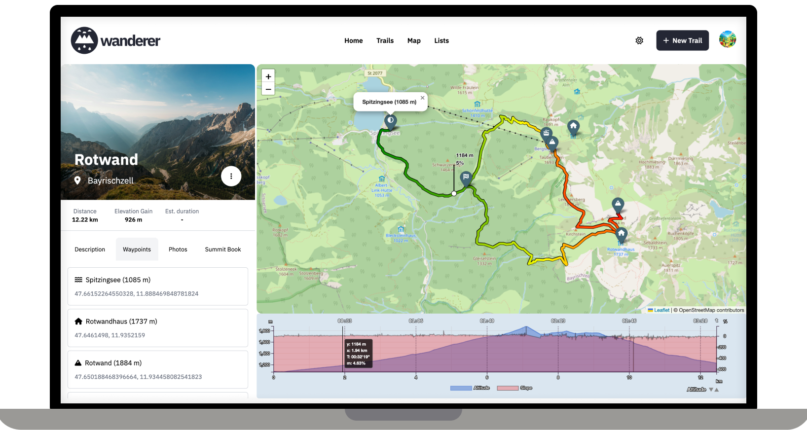

<h4 align="center">
  

  The trail catalogue that makes your GPS data searchable
</h4>

wanderer is a self-hosted trail database. You can upload your recorded tracks and add various metadata to create an easily searchable catalogue. 

## Core Features



- Manage your trails
- Extensive map integration and visualization
- Share trails with other people and explore theirs
- Advanced filter and search functionality
- Create custom lists to organize your trails further


## Getting started
The recommended and quickest way to install wanderer is using docker compose:

``` bash
# clone the git repository
git clone https://github.com/Flomp/wanderer
cd wanderer
# build and launch via docker compose
docker compose up -d --build
```

You can now access the frontend at localhost:3000.

> Note: if you are using wanderer in a production environment make sure to change the MEILI_MASTER_KEY.

You can also run wanderer on bare-metal. Check out the documentation for a detailed how-to guide.

## License
This project is licensed under the AGPLv3 License. See the [LICENSE](LICENSE) file for the full license text.
