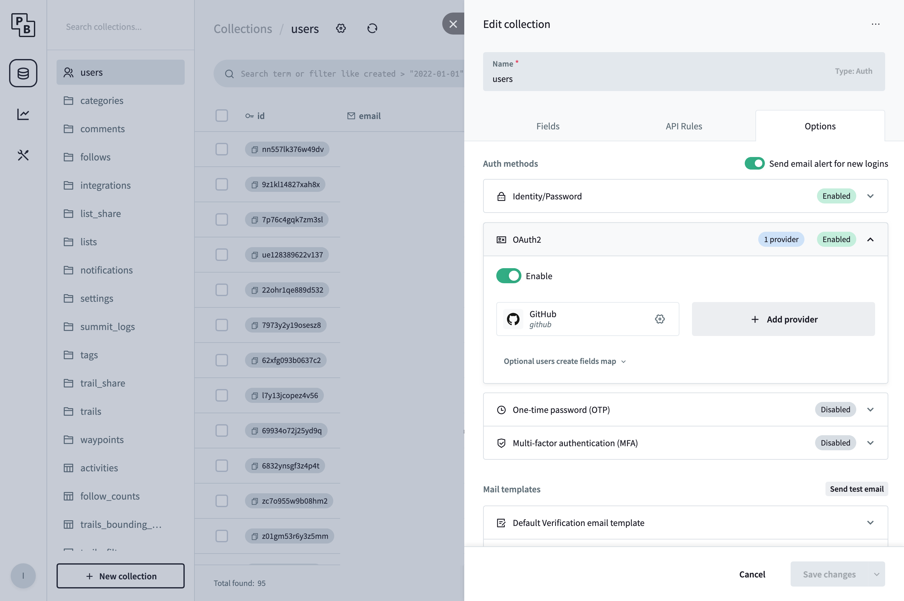

For the majority of wanderer's features you need an account to interact with them.

## Email/Username & Password

The quickest way to create an account is by heading over to `/register` and entering a username, a valid email address, and a password of your choice.
After registering you will be redirected to the homepage and can start creating your first trail.

:::note
The username must be at least 3 characters long, the password at least 8.
:::

## OAuth2

Alternatively, wanderer supports authenticating via OAuth2. The following providers are supported:

- GitHub
- Apple
- Google
- Microsoft
- Yandex
- Facebook
- Instagram
- GitLab
- Bitbucket
- Gitee
- Gitea
- Discord
- Twitter
- Kakao
- VK
- Spotify
- Twitch
- Patreon (v2)
- Strava
- LiveChat
- mailcow
- OpenID Connect

### Prerequisites

To set up OAuth support you will need to access the PocketBase backend. Make sure to forward port 8090 of the `wanderer-db` container. Access the PocketBase admin panel in your browser at `http://<your_pocketbase_url>:8090/_/` and create an admin account.

### Create an OAuth app

This step will vary wildly from provider to provider. Please refer to your provider's documentation for the specific steps. 

No matter your provider, you will need a redirect URL. This redirect URL must have the following format: `$ORIGIN/login/redirect`. `$ORIGIN` refers to the `ORIGIN` environment variable that defines the public host at which your wanderer instance can be reached. So for the default installation, the redirect URL is `http://localhost:3000/login/redirect`. 

In any case, once you have successfully created your OAuth app you will receive a Client ID and a Client Secret.

### Enable a provider in PocketBase

In the PocketBase admin panel navigate to the `users` table. Click the gear icon at the top to open the table's settings and navigate to `Options`. In the tab `OAuth2`, add your provider and fill in the Client ID and Client Secret from the step before and save your changes.

### Login using OAuth

That's it! You should now see your OAuth provider appear in wanderer's login form. Click the button, authorize wanderer, and wait for the authentication to finish. You are now logged in and can use wanderer like any other user.

## Forgot your password?
wanderer offers the option to send password reset emails in case a user forgets his password.

### Prerequisites

To set up password reset emails you will need to access the PocketBase backend. Make sure to forward port 8090 of the `wanderer-db` container. Access the PocketBase admin panel in your browser at `http://<your_pocketbase_url>:8090/_/` and create an admin account.

### Configure SMTP settings 

Next in the pocketbase admin panel go to Settings -> Mail settings an enable "Use SMTP mail server". Enter the details of your SMTP server and send a test email to ensure your configuration is correct. On the same page you can also adjust the email template of the password reset email.

Alternatively, you can set these options via the respective [environment variables](/getting-started/configuration/#pocketbase).

### Request password reset
Once the SMTP access is configured, users can click the "Forgot password" link in the login form. After requesting the reset the user will receive an email with a unique link to reset their password.