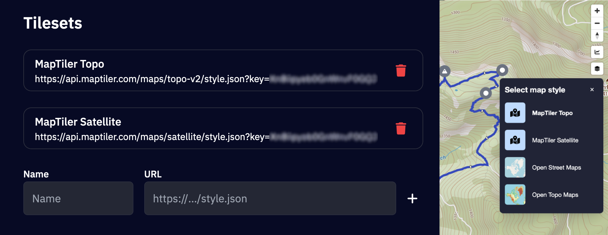
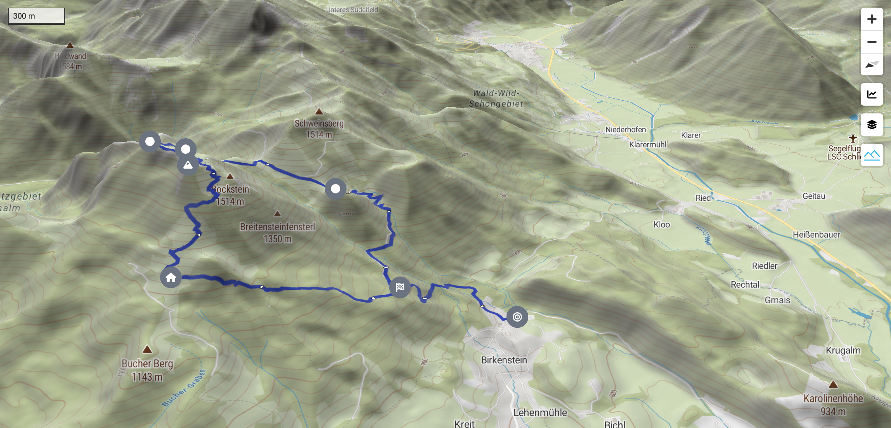
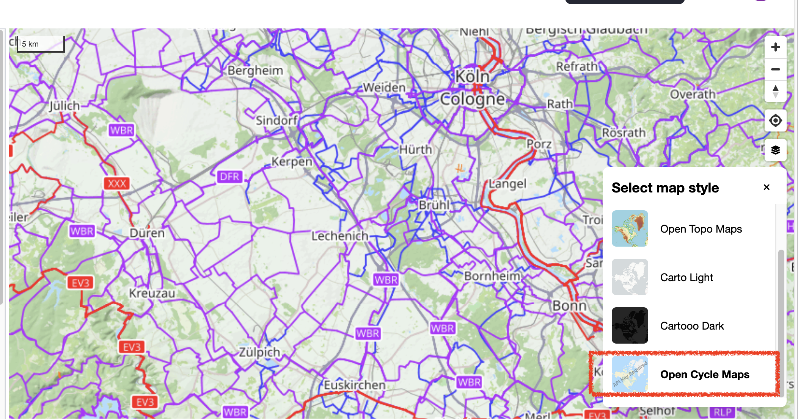
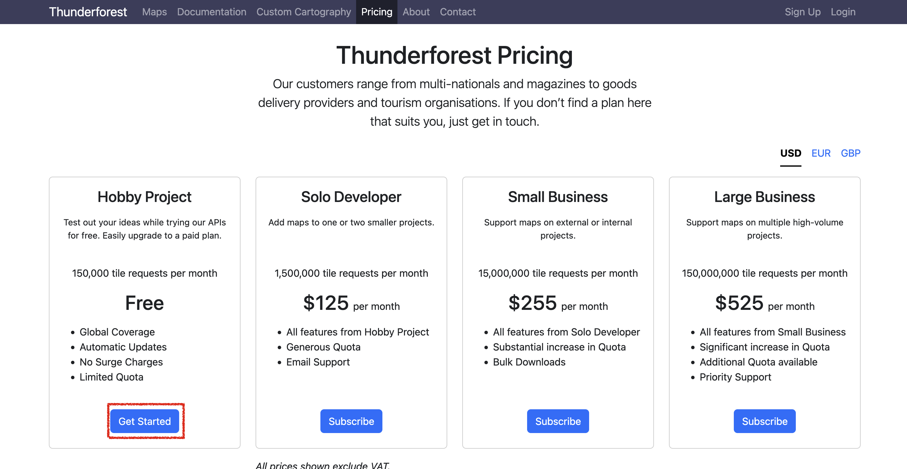
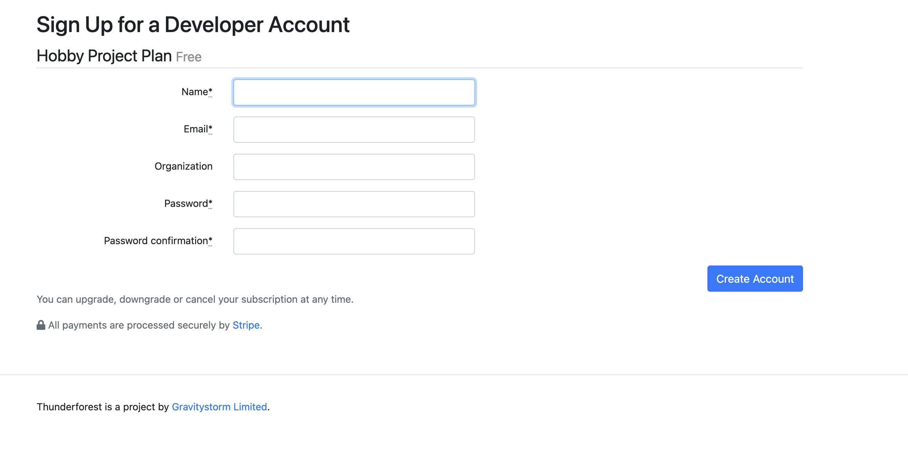
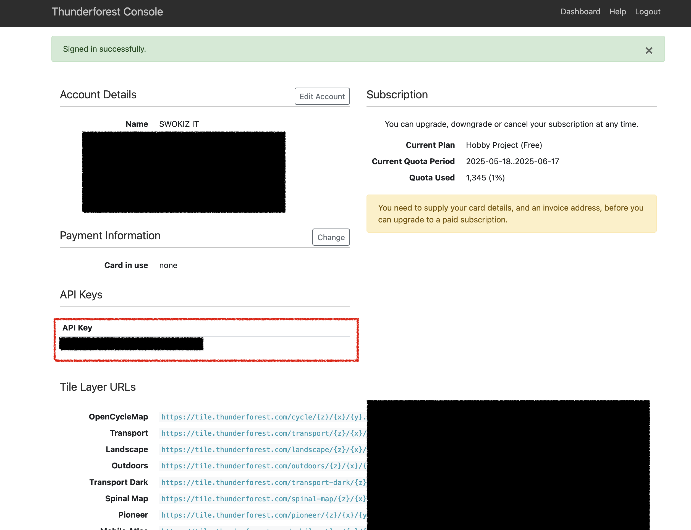

wanderer is compatible with any provider of vector tile maps (e.g. CARTO, mapbox, maptiler, or self-hosted OpenMapTiles). Out of the box it comes with 4 different map styles:
1. Open Street Maps
2. Open Topo Maps
3. CARTO Light
4. CARTO Dark

You can switch between these styles by opening the style switcher menu with the button on the right side of every map.

## Custom map styles

To further personalize your map, you can add custom map styles by providing a URL to a `style.json` file. This allows you to fully control the map’s appearance using your own vector tile styles. Follow these steps to add and use your custom styles:

1. Navigate to `Settings -> Display`.
2. Under the `Tilesets` section, you can add your custom map styles:
    - Enter an arbitrary name for your style (this is how it will appear in the style switcher menu).
    - Paste the URL pointing to your `style.json` file. This file should define the vector tile style you want to use.
3. Click the + button to save your style.

Once added, your custom style will be available in the style switcher menu, allowing you to quickly apply it to the map.

## Terrain & Hillshading

To enhance wanderer's map visualization, you can add two types of data sources to display 3D Terrain and Hillshading. This is achieved by providing URLs pointing to the required `tiles.json` files. Both the terrain and hillshading data must be in Mapbox TileJSON format and accessible through the provided URLs.

To add the respective URLs navigate to `Settings -> Display` and add them in the `Terrain` section. After adding the terrain & hillshading source, you can explore the 3D map view by interacting with the compass control on the map.

1. Enable 3D terrain with the control on the bottom-right.
2. Locate the compass control in the top-right corner of the map.
3. Click and drag the compass control to tilt the map into 3D mode.
4. Adjust the tilt and rotation as desired to view the terrain in 3D.

## Thunderforest Maps

Optionally thunderforest maps can be configured by setting the `PUBLIC_THUNDERFOREST_API_KEY` environment variable. This will e.g. enable opencycle maps. For this its neccessary to obtain an API Key which requires [free registration](https://manage.thunderforest.com/users/sign_up?price=hobby-project-usd ) at Thunderforest.

