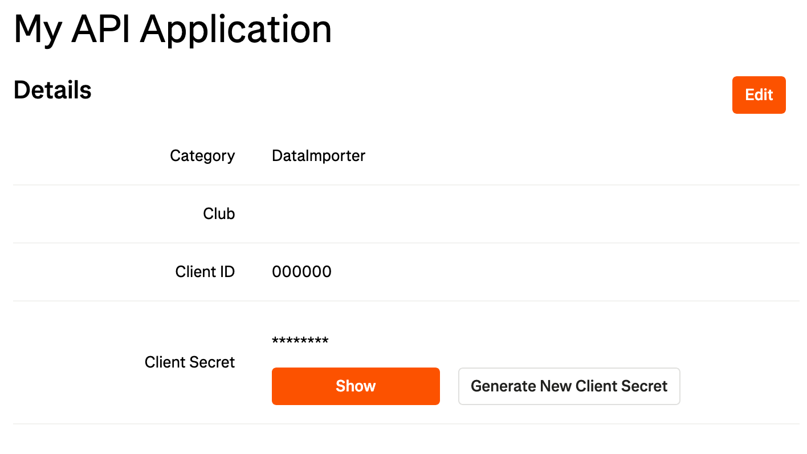
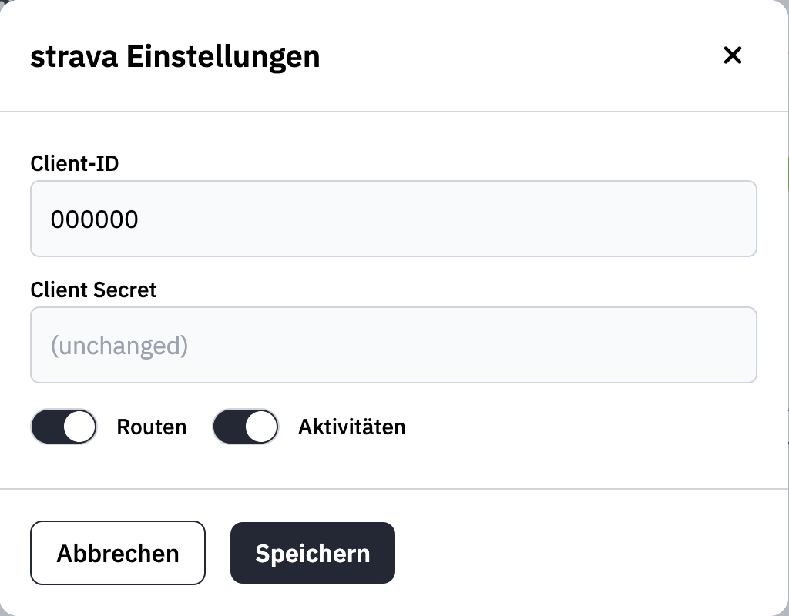

You can automatically sync trails to wanderer at regular intervals using the third-party integration feature. Currently, we support two providers: **strava** and **komoot**.

It is important to note that synchronization only works from the provider to wanderer and not the other way around. Additionally, if a trail has already been synced to wanderer, subsequent changes made in the provider will not be transferred unless the trail is deleted in wanderer.

## Prerequisites

wanderer encrypts the credentials required to log in to either provider. To enable this encryption, you must create an encryption key and provide it via the `POCKETBASE_ENCRYPTION_KEY` [environment variable](/getting-started/configuration#pocketbase) to the `wanderer-db` container. To generate a new encryption key, run the following command:

```bash
openssl rand -hex 16
# Example output: ce7f0ddb97100c42e6409a8537c11e23
```

:::caution
Do not share this key with anyone!
:::

Once you have set the encryption key, restart the `wanderer-db` container and navigate to `/settings/integrations`.

## strava Integration

### Creating an App in strava

Before integrating strava with wanderer, you need to create an API application in strava. Visit [strava's API settings](https://www.strava.com/settings/api) and follow the steps to create a new API application. Your setup should resemble the following:



### Setting Up the Integration

1. Copy the **Client ID** and **Client Secret**.
2. Go to the integrations page in wanderer's settings.
3. Click the settings button for the strava integration.
4. Enter your **Client ID** and **Client Secret**.
5. Choose whether you want to sync routes, activities, or both.



6. Save the settings and toggle the integration on.
7. You will be redirected to strava's authorization page. Keep all checkboxes selected and click **Authorize**.
8. You will then be redirected back to wanderer. The strava integration is now active.

## komoot Integration

The komoot integration requires only your komoot username and password:

1. Open the komoot settings from the integrations menu.
2. Enter your komoot credentials.
3. Save the settings.
4. Toggle the integration on. It will become active immediately.

Your planned and completed trails will now sync with wanderer.

## Sync Interval

By default, trails are synced every night at **02:00 AM**. You can modify this schedule using the `POCKETBASE_CRON_SYNC_SCHEDULE` [environment variable](/getting-started/configuration#pocketbase).

:::note
Please set a reasonable sync interval. Both strava and komoot impose usage limits on their APIs. Exceeding these limits may result in rejected requests or account suspension.
:::

