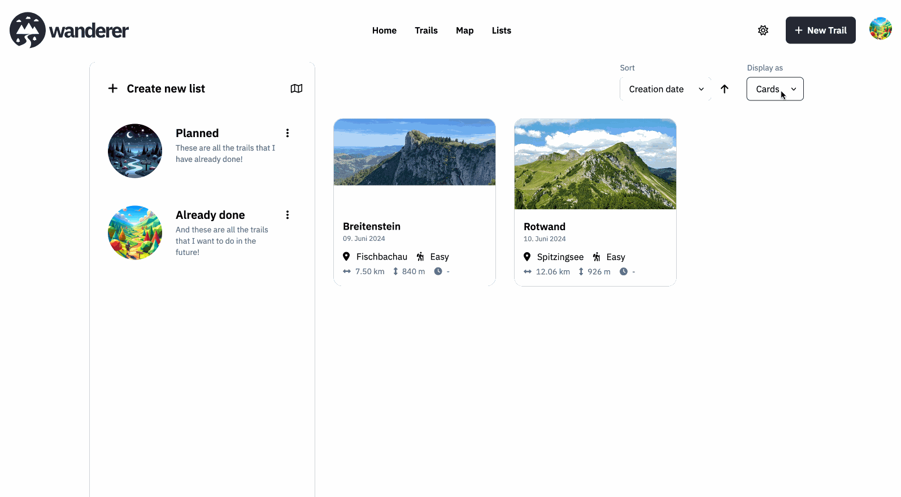

Lists allow you to further organise your trails by bundling them in one place. Over at `/lists` you can create, update, and delete your custom lists. You can view all trails in a list either on a map or in a simple list.

## Create a list

Simply click the `+ Create new list` button and give your list a name. Optionally, you can also add an avatar and a short description.

## Add a trail

To add a trail to a list head over to `/trails` and click on the trail you want to add. From the ⋮ menu select "Add to list" and select the list you want to add the trail to. To remove the trail simply repeat this process.

## Edit & delete a list

To edit or delete a list simply select the respective entry from the ⋮ menu.