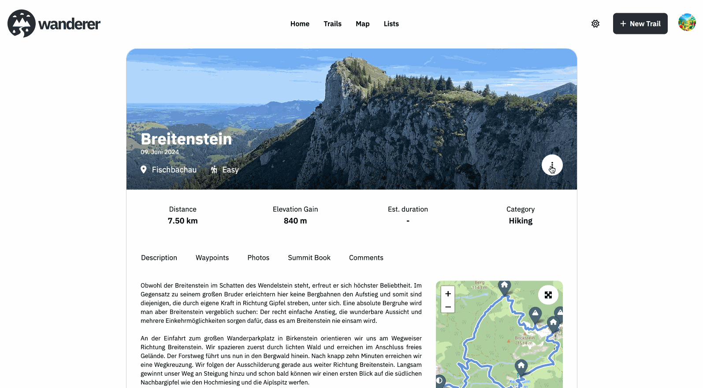

wanderer allows you to share your trails with other users. You can either publish you trail making it accessible for everyone or share it with specific users. To get started head over to `/trails` and select the trail you want to share or publish.

## Publish a trail

From the ⋮ menu select "Edit". In the panel on the right toggle the "Public" switch to on and save the trail. Your trail is now public and everyone can see it. Even people without an account.

## Share a trail

If you want to be more particular about who can see your trail you can instead share your trail. From the ⋮ menu select "Share". In the dialog, search for the user you want to share your trail with. You can now choose the permission the user should have. You can choose between "View" or "Edit". A user with "Edit" permission can change all data (including the route) of the trail.

If you no longer want to share the trail with a user, simply click the red trashcan icon next to their name.