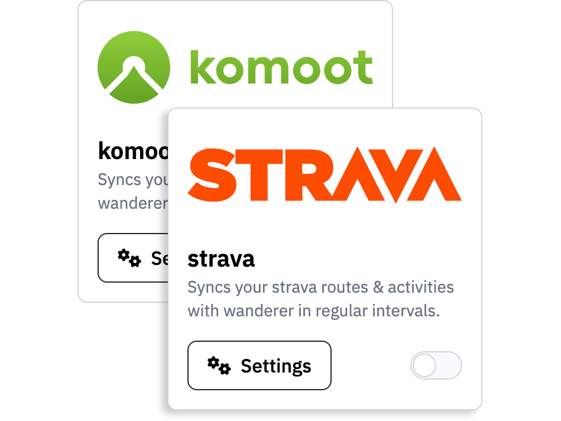
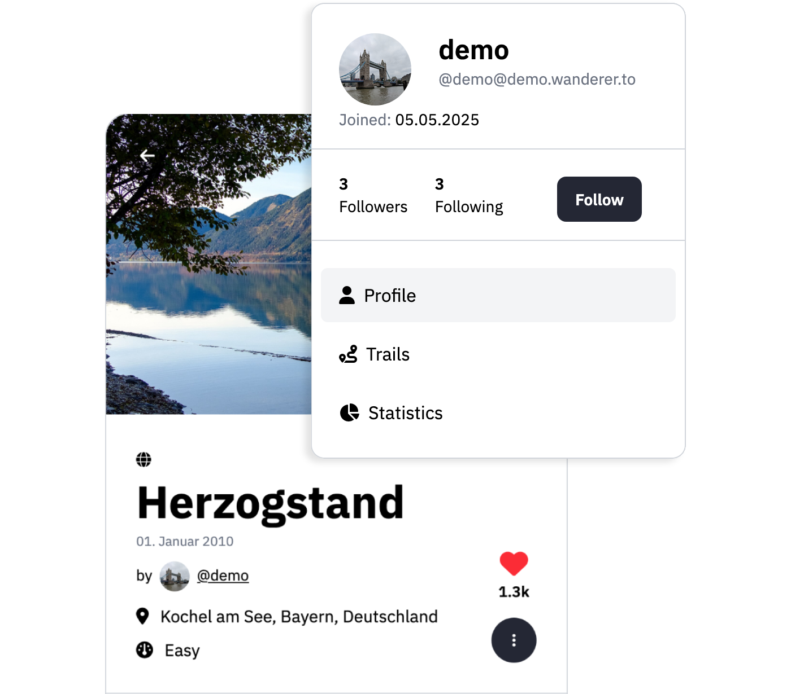

import { Card, CardGrid } from '@astrojs/starlight/components';

  

    
  

  

    <h1>Plan your trails wherever you go</h1>
    

      Whether you're hiking through remote mountains or biking across the city, wanderer makes it easy to plan, record, and revisit your adventures. Draw new routes, upload GPS files, and access your trail data from any device — all while keeping full control over your data.
    

  

  

    <h1>Import your trails from your favourite providers</h1>
    

      Already tracking your adventures with Komoot or Strava? wanderer makes it easy to bring your existing trail history with you. With built-in support for both platforms, you can import your routes and activities directly — no file conversions needed. Consolidate your outdoor journeys in one place, fully under your control.
    

  

  

    
  

  

    
  

  

    <h1>Explore together, even apart</h1>
    

      wanderer isn’t just about trails — it’s about the people who share them. Follow other users to see their latest routes, like and comment on trails you love, and get notified when someone adds something new. Whether you're part of a local hiking group or just discovering new paths, wanderer makes it easy to stay connected — across instances and platforms.
    

  

# Why wanderer?

  

    <Card class="mt-4" title="Decentralized" icon="random">
        wanderer is built on the ActivityPub protocol, meaning your instance can connect with others to share trails, profiles, and updates. Follow users across the network, discover new trails from different communities, and interact seamlessly with other federated platforms like Mastodon — all without relying on a central server.  
    </Card>
  

  <Card title="Privacy-first, always" icon="approve-check">
    Self-hosted and open-source, wanderer puts you in full control of your data. No tracking, no vendor lock-in, no compromises — your trails stay on your server.
  </Card>
  <Card title="Full-featured API" icon="seti:json">
    Automate your workflows or build on top of wanderer with its comprehensive JSON API. Access, modify, and query your trail data programmatically.

    [API reference →](/api-reference)
  </Card>

# Support wanderer

wanderer is a passion project and will always stay free and open-source. If you like wanderer and want to support its development you can make a donation.

  <a class="p-4 text-white rounded-full flex  items-center" style="background: var(--sl-color-text-accent)" href="https://buymeacoffee.com/wanderertrails"> 
    
    Buy me a coffee
  </a>
  <a class="p-4 text-white rounded-full flex items-center" style="background: var(--sl-color-text-accent)" href="https://liberapay.com/wanderer"> 
        
    Liberapay
  </a>

# Contributing
Help is welcome at any time. Check out the [GitHub repository](https://github.com/Flomp/wanderer). to get started. If you are not sure where you can help, check the [roadmap](https://github.com/users/Flomp/projects/2) for features in the backlog. If you would like to contribute a translation, you can do so [here](https://crowdin.com/project/wanderer).
