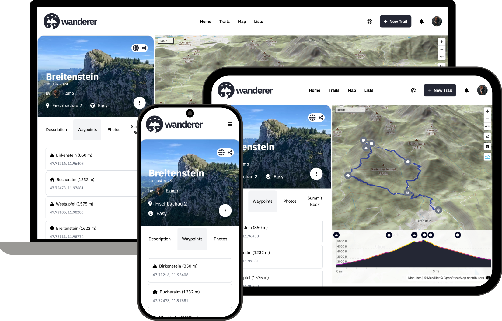

import { Card, CardGrid } from '@astrojs/starlight/components';

## Features

  

    <Card title="Manage your trails" icon="pencil">
      Upload your trails from multiple file formats (like GPX or TCX) or plan a new trail directly in wanderer with the route drawing tool.

      [Learn more →](/guides/create-a-trail)
    </Card>
  

	<Card title="Advanced filters and search" icon="magnifier">
		wanderer comes with extensive filter and search functionality right out of the box, so you can focus only on the trails relevant to you.
	</Card>
  <Card title="Automatic import" icon="seti:folder">
		Simply upload all your trails in one go with wanderer's automatic import feature.

    [Learn more →](/guides/import-export#import)
	</Card>
	<Card title="Full API support" icon="seti:json">
		Use wanderer's API to interact with your trail data directly and automate the tasks you don't want to do manually.

    [API reference →](/api-reference/auth)
	</Card>
  <Card title="Privacy friendly" icon="approve-check">
		wanderer is self-hosted and open-source. Your data stays on your machine and your machine only.
	</Card>
  <Card title="i18n" icon="translate">
		We currently support 8 different languages, with plans to add more in the near future.
	</Card>

## Contributing

Help is welcome at any time. Check out the [GitHub repository](https://github.com/Flomp/wanderer). to get started. If you are not sure where you can help, check the [roadmap](https://github.com/users/Flomp/projects/2) for features in the backlog. If you would like to contribute a translation, you can do so [here](https://crowdin.com/project/wanderer).

## Support wanderer

wanderer is a passion project and will always stay free and open-source. If you like wanderer and want to support it's development you can make a small donation and [buy me a coffee](https://buymeacoffee.com/wanderertrails).