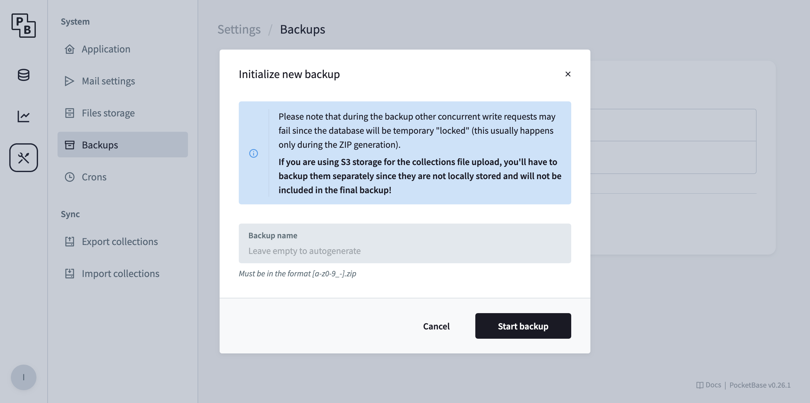

wanderer has two components that persist data: meilisearch and PocketBase. 
However, the data from meilisearch can be fully reconstructed from PocketBase. 
This happens automatically when you start wanderer. 
It is therefore only necessary to back up the data generated by PocketBase. 

## Backup via dashboard

Probably the most convenient method to back up your data is using the PocketBase admin dashbboard. 

1. Navigate to `Settings` -> `Backups` 
2. Press the `Initialize new backup` button. 
3. Give your backup a name and start it. That's it! 

If you want to back up your data in regular intervals you can do so by enabling auto backups in the backup options.

## Backup manually

Alternatively, if you require a more custom backup solution, you can simply backup the files directly on your server. 
All data is saved in folder called `pb_data`. 
If you installed wanderer via docker it is mounted as a volume. 
Check your `docker-compose.yml` file for its location. 
In there you typically find a `data.db` and `auxillary.db` file containing all table information of your instance. 
Furthermore, `pb_data` contains a `storage` folder holding all file upload data (e.g. GPX/image files). 

You can simply copy these files to your backup location using your preferred file transfer method. 

## Restore

:::caution
**Important**: Restores are only supported when the **minor version** of your wanderer instance matches the minor version of the backup. 
For example, a backup created with version `0.17.x` can only be restored into another `0.17.x` installation. 
Restoring across major or minor versions is not guaranteed to work and may result in data loss or corruption.
:::

### Restore via dashboard

If you created your backup using the PocketBase admin interface, restoring it is just as easy:

1. Open the PocketBase admin dashboard.
2. Navigate to Settings → Backups.
3. Locate the backup you want to restore.
4. Click the Restore button next to it and confirm.

PocketBase will automatically stop the running instance temporarily, replace the current data with the selected backup, and restart the database.

After that, wanderer will rebuild the search index from the restored data automatically on the next start.

### Restore manually

If you backed up your data by copying the pb_data folder directly, restoring is simply a matter of replacing the current data directory:

1. Stop the running wanderer instance (e.g. using docker compose down).
2. Replace the contents of your current pb_data folder with your backup copy.
3. Start wanderer again (docker compose up -d or equivalent).

Just like with the dashboard method, the Meilisearch index will be rebuilt automatically from the restored PocketBase data.

