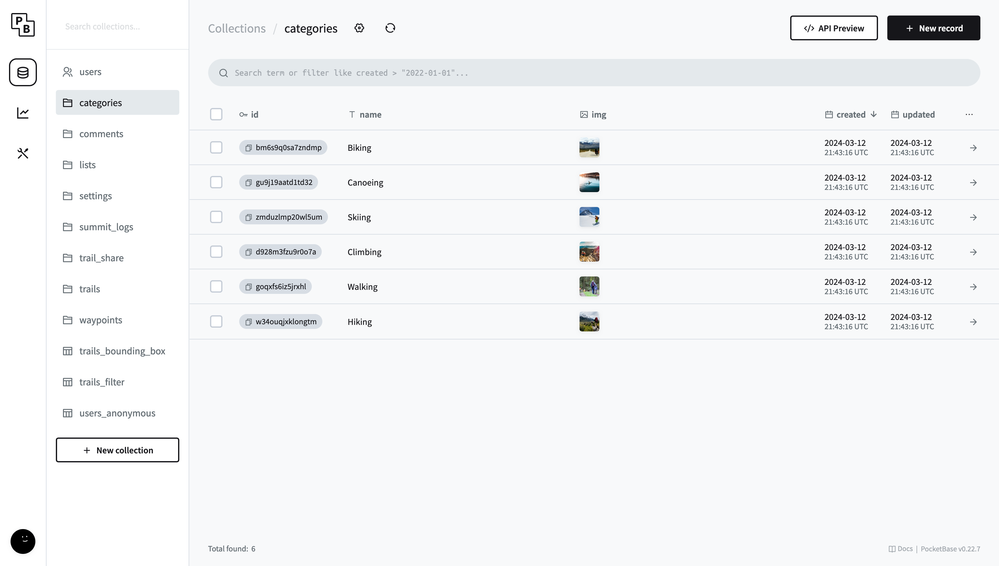

wanderer uses categories to classify what kind of activity a trail belongs to. Out of the box you get: Biking, Canoeing, Climbing, Hiking, Skiing and Walking. However, you can adapt these categories to your needs or add completely new ones.

## Modifying categories

In the PocketBase admin panel, click on the `categories` table in the list on the left side. All existing categories will be listed here. To edit one simply click on the row, edit the data you want to change, and click "Save". To delete a category check the box at the beginning of the row and click "Delete selected". To create a new category click the "New record" button in the top right corner, give your new category a name and a background image, and click "Save".
