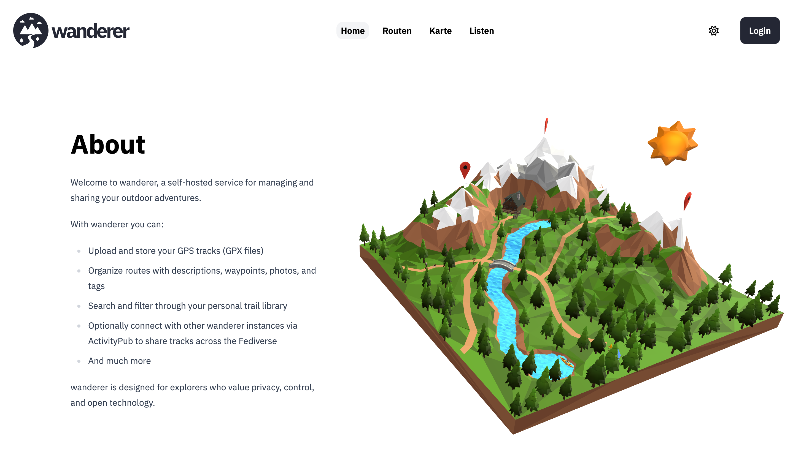

Users that are not logged in will see an _About_ section on the front page of of <span class="-tracking-[0.075em]">wanderer</span>. You can completely customize this section to give users important information about your specific instance. 



The content of the _About_ section is written in [Markdown](https://www.markdownguide.org/cheat-sheet/). E.g. the default content that you see above looks as follows:

```Markdown
Welcome to wanderer, a self-hosted service for managing and sharing your outdoor adventures.

With wanderer you can:
- Upload and store your GPS tracks (GPX files)
- Organize routes with descriptions, waypoints, photos, and tags
- Search and filter through your personal trail library
- Optionally connect with other wanderer instances via ActivityPub to share tracks across the Fediverse
- And much more

wanderer is designed for explorers who value privacy, control, and open technology.
```

Depending on how you installed <span class="-tracking-[0.075em]">wanderer</span> the process of editing the content looks slightly different:

## Installed via Docker

1. Open your docker-compose.yml file.
2. Find the `volumes` section of the `web` container.
3. Look for the following line (it is commented out by default):
```yaml 
 - ./data/about.md:/app/build/client/md/about.md
 ```
4. Uncomment the line (remove the `#` at the beginning, if present).
5. Make sure the left-hand side (`./data/about.md`) points to a valid Markdown file on your host machine.
6. Save your changes and restart the container:
```bash
docker compose restart web
```
7. Whatever you put in that Markdown file will now appear in the _About_ section.

 ## Installed from source
1. Navigate to the `web/build/client/md/` directory.
2. Open the file `about.md` in your text editor of choice.
3. Replace the contents with your own Markdown text.
4. Save the file.
5. No rebuild is required — the file is loaded dynamically at runtime.