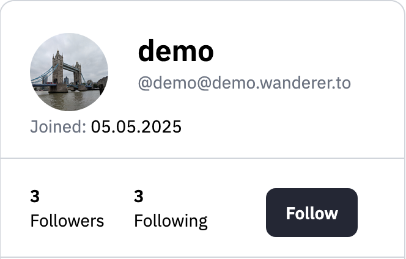

wanderer is part of the fediverse — a decentralized network of connected apps and communities. This allows users across different platforms and servers to follow each other, interact with trails, and stay updated on adventures — all using a universal identity.

## Your Federated Identity

Every wanderer user has a unique handle in the format:

```
@username@domain
```


For example: `@alice@wanderer.to`. This lets others on compatible platforms (like Mastodon or other wanderer instances) discover and follow you.

---

## Following Other Users




You can follow other wanderer users. Once you follow someone, their new public trails and lists will be automatically synced to your instance and appear in your feed. You can interact with these trails and lists as if they exist on your own instance.

### How to Find Users

To discover and connect with other Wanderer users, you can use the search bar located on the Wanderer homepage. Simply enter the name or full handle of the user you're looking for—for example, `@bob@trails.social`. The search will return matching profiles from your instance as well as from other federated wanderer servers.

Once you've found the profile you're interested in, click on it to view the user's public profile page. From there, you can see their shared trails and lists, and choose to follow them.

## Social Features

wanderer supports a rich social experience:

- **Summit Logs**  
  Other users can add summit logs to your trails to share their experiences.
- **Comments & Likes**  
  Users can comment on and like any public trail.
- **Mentions**  
  Users can mention each other using their handle: `@username@domain`


Mentions work in:
- Comments
- Trail descriptions
- Summit log descriptions

## Notifications

Wanderer notifies you about important interactions from the community. Notifications can appear on the website and/or be sent via email, depending on your preferences.

You can configure which types of notifications you want to receive in your settings. Each notification type can be toggled individually, and you can choose whether to receive it on the website, by email, or both.

### Notification Triggers

You may receive a notification when:

- Someone leaves a comment on your trail
- You have a new follower
- Someone shares a trail with you
- Someone likes your trail
- Someone shares a list with you
- Someone creates a summit log on your trail
- Someone mentions you in a trail description
- Someone mentions you in a comment
- Someone mentions you in a summit log description