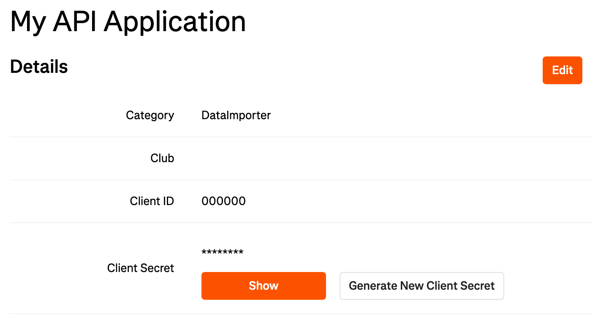
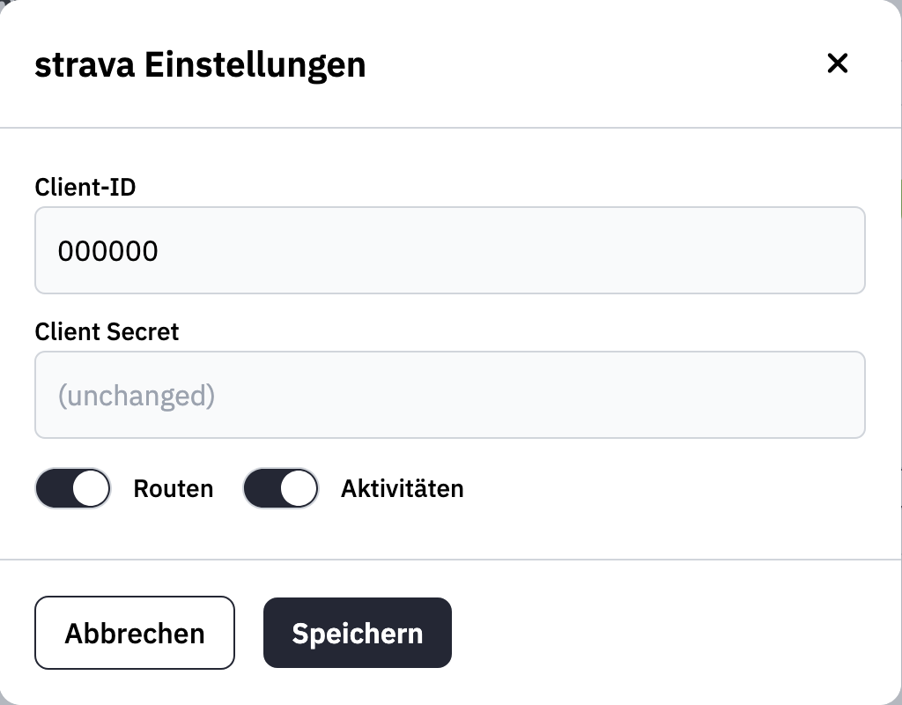

Plugins add optional functionality that is not built into the core application.
Once an administrator has installed a plugin, it appears in the plugin settings
page where users can configure and enable it.

Plugin installation and self-hosted connector trust settings are administrator
tasks. See [Plugin installation](/run/installation/plugins) for runtime bundle
and connector details.

## Plugin Types

The plugin settings page groups plugins by type:

| Type | Purpose |
| --- | --- |
| Trails | Sync or send trails, routes, and activities from external providers. |
| Assets | Find and import media assets, such as geotagged photos, from external libraries. |

Trail plugins usually run in the background after they are enabled. Asset
plugins are also available while editing trails and waypoints, where they can
suggest matching photos based on time and location.

## Strava Plugin

:::caution[A Strava subscription is required]
With Strava's June 2026 Developer Program update, accessing the Strava API as a
"Standard Tier" developer requires an active Strava subscription. Because each
wanderer user connects with their own
Client ID and Client Secret, everyone using this plugin counts as a Standard
Tier developer and is subject to this requirement.

- **New developers:** subscription required since **June 1, 2026**.
- **Existing developers:** subscription required from **June 30, 2026**.
- Active developers without a subscription are granted **3 months free** to
  transition — redeem the offer from your
  [Strava API settings dashboard](https://www.strava.com/settings/api).

Your personal data export and device/wearable integrations are **not** affected;
only programmatic API access is. A free (non-subscriber) Strava account can no
longer use this plugin once the transition period ends. For details see Strava's
[Developer Program update](https://communityhub.strava.com/insider-journal-9/an-update-to-our-developer-program-13428)
and [API FAQ](https://communityhub.strava.com/developers-knowledge-base-14/strava-api-faq-12906).
:::

### Creating an App in Strava

Before integrating Strava with wanderer, you need to create an API application in Strava. Visit [Strava's API settings](https://www.strava.com/settings/api) and follow the steps to create a new API application. Your setup should resemble the following:

### Setting Up the Plugin

1. Copy the **Client ID** and **Client Secret**.
2. Go to the plugins page in wanderer's settings.
3. Click the settings button for the Strava plugin.
4. Enter your **Client ID** and **Client Secret**.
5. Choose whether you want to sync routes, activities, or both.

6. Click **Save & connect**.
7. You will be redirected to Strava's authorization page. Keep all checkboxes selected and click **Authorize**.
8. You will then be redirected back to wanderer.
9. Toggle the plugin on. It is now active.

If you later change the Client ID or Client Secret, reconnect the plugin. Other
settings can be saved without repeating the OAuth flow.

## komoot Plugin

The komoot plugin requires only your komoot username and password:

1. Open the komoot settings from the plugins menu.
2. Enter your komoot credentials.
3. Save the settings.
4. Toggle the plugin on. It will become active immediately.

Your planned and completed trails will now sync with wanderer.

## Hammerhead Plugin

The Hammerhead plugin requires your Hammerhead account details:

1. Open the Hammerhead settings from the plugins menu.
2. Enter your Hammerhead email and password.
3. Choose whether you want to sync planned tours, completed tours, or both.
4. (Optional) Set an "ignore trails before" date to avoid syncing duplicates if your Hammerhead account is already connected to other services.
5. Save the settings and toggle the plugin on. It will become active immediately after a successful login.

## Immich Plugin

The Immich plugin is an asset plugin. It searches your Immich library for
geotagged photos that match a trail or waypoint and imports the selected photos
as wanderer photo assets.

Before configuring the plugin, create an API key in Immich:

1. Open Immich in your browser.
2. Go to your account settings.
3. Create an API key and copy it.

Grant only these Immich permissions to the key:

| Permission | Used for |
| --- | --- |
| `user.read` | Validating the API key and resolving your Immich user for "Only my photos". |
| `asset.read` | Searching geotagged photos and reading selected asset metadata. |
| `asset.view` | Loading thumbnail previews. |
| `asset.download` | Downloading the original file when wanderer imports or materializes a photo. |

The plugin does not need write, delete, upload, album, library, or admin
permissions.

Then configure wanderer:

1. Open the plugins page in wanderer settings.
2. Open the Immich plugin settings.
3. Enter the Immich server URL and API key.
4. Adjust the search window, search radius, maximum waypoints, and "Only my photos" setting if needed.
5. Choose the photo mode.
6. Save the settings and toggle the plugin on.

Photo modes:

| Mode | Meaning |
| --- | --- |
| Store photos in wanderer | Downloads selected photos into wanderer immediately. |
| Link remote references (private trails only) | Keeps a private link to the Immich asset and fetches the file on demand. When the trail is made public, the photo is copied into wanderer, because a remote link cannot be served to anonymous viewers. |

When an asset plugin is enabled, wanderer can suggest matching photos in these
places:

- after importing a completed trail or uploading a time-stamped GPX track, if automatic attachment is enabled
- while editing a trail, to create photo waypoints from matching photos
- while editing a waypoint with coordinates, to attach matching photos

Automatically imported photo waypoints are merged using the trail category's
waypoint merge radius. New waypoint names are resolved from nearby OpenStreetMap
points of interest via Overpass, falling back to Nominatim reverse geocoding
and finally the photo coordinate.

If you disable an asset plugin while linked remote photos still exist, wanderer
asks whether it should download or delete those linked photos first.

:::note
This page still describes provider setup at a high level. Provider-specific details depend on the installed plugin's manifest and capabilities.
:::
