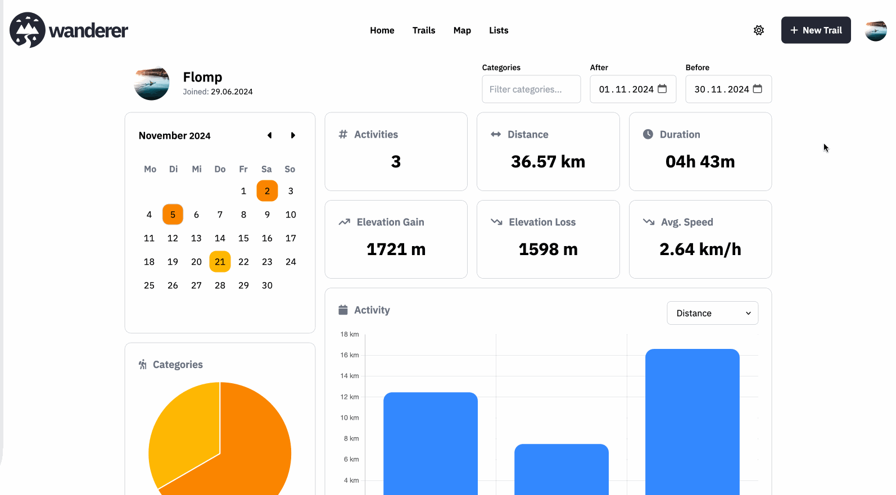

wanderer can show you a wide range of useful statistics about your latest adventures. Head over to the profile page (`/profile`) to get started. The statistics include your [summit logs](/use/summit-logs) as well as trails explicitly marked as completed. A completed trail is used as a fallback only while you have no summit log for it. One of your own summit logs suppresses that fallback regardless of the selected period; summit logs added by other users have no effect. Add GPS data to a summit log or trail to include detailed distance and elevation values.

With the filters in the top right corner you can determine which activities should be included in the statistics. The calendar shows activities from that selected period, and you can browse only the months covered by it. It opens on the current month when that month overlaps the selected period; otherwise it opens on the period's first month. Calendar navigation does not change the selected date range. With the drop-down menu above the activity bar chart you can determine which metric should be visualized in the time series graph.

In the table at the bottom of the page you see an overview of all activities that match your selected filters. Clicking on the route preview at the beginning of each row will display the route on a more detailed map so you can take a closer at all the relevant data.
