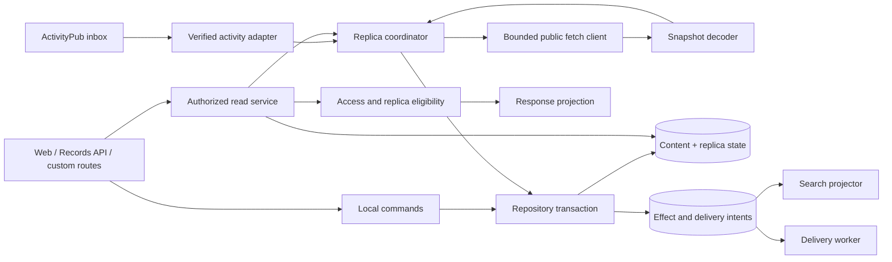

# Architecture boundaries and data ownership

Status: **DRAFT / PROPOSED**. This chapter specifies a target architecture for review, not implemented behavior. Requirement IDs `ARC-*` belong to this chapter. Product decisions remain subject to [07-decisions.md](07-decisions.md).

The baseline is local integration commit `865251d49`. Existing PocketBase collections, ActivityPub identities and application endpoints are retained during the initial refactoring. See [08-evidence.md](08-evidence.md) for reproducible source references and the later test improvement observed on 2026-09-13.

**Scope:** P0–P2 select the import and response boundaries, targeted fixtures and existing-policy contracts from this chapter. The full diagram, additional storage, durable effects and universal output gate describe deferred P3+ options. They are not infrastructure prerequisites for extracting an allowlisted decoder or keeping a response isolated. The initial deployment model is one backend process with SQLite; cross-process workers require a separate justified decision.

## 1. Goals and constraints

**ARC-001 — Separate responsibilities inside the existing application.** Establish explicit boundaries between user commands, remote import, replica state, authorized reads, indexing, and delivery. A new service deployment, a replacement database, and a new federation protocol are not prerequisites.

**ARC-002 — Preserve the security fixes.** The read-rule, immutable-share-target, checked-expansion, local-sync-field and response-isolation fixes form the starting point. No refactor may replace them with direct unrestricted record access merely to simplify an interface.

**ARC-003 — One behavioral contract, several enforcement adapters.** PocketBase rules continue to authorize ordinary Records API operations. Custom routes, file serving, federation inputs and indexing need explicit adapters implementing the same access matrix. A new Go helper is not sufficient if the Records API or public file route can bypass it.

**ARC-004 — No implicit network side effects from rendering.** A read may request or schedule synchronization through the coordinator; relation expansion, serialization and search result formatting must not perform arbitrary remote calls. Network budgets and cache decisions are made before presentation.

## 2. Proposed component model



Arrows express permitted collaboration, not package import syntax. `READ` authorizes the caller, reads a stable projection, and applies replica eligibility. It must not hand its response record to the coordinator for mutation.

| Component | Owns | Must not own |
| --- | --- | --- |
| Local command adapter | Authenticated intent, input validation, immutable-field checks | Remote authorship impersonation; arbitrary import privileges |
| Verified activity adapter | Signature/actor/recipient context, activity classification | Treating delivery alone as a public-read grant |
| Public snapshot decoder | Bounded parsing, typed remote fields, relation completeness | Local IDs, grants, replica state, response expansions |
| Replica coordinator | Fetch scheduling, evidence, generations, transitions | Viewer-specific rendering; browser query propagation |
| Repository transaction | Atomic content/state/effect-intent changes | Network requests; waiting for Meilisearch or delivery |
| Read service and presenter | Principal-specific projection and explicit error mapping | Persistence writes through an expanded response record |
| Search projector | Search documents and incremental updates | Granting access on the basis of an old indexed ACL |
| Delivery worker | Per-recipient attempts and durable outcomes | Reporting remote receipt as a completed local transaction |

**ARC-005 — Typed identities.** Keep separate types or validated wrappers for `LocalUserID`, `LocalRecordID`, `ActorIRI`, `ObjectIRI`, `ActivityIRI`, `ShareToken` and `ReplicaID`. A remote actor with no local user is not an anonymous principal. A signing actor is not necessarily the author of an object embedded in an Announce.

**ARC-006 — Identity preservation.** Resolve a remote object by its canonical IRI. Map that IRI to a local ID through the repository. Never load a remote PocketBase `id` into the local primary key. Preserve case-sensitive path/query identity; normalization may standardize scheme/host/default port only under a documented equivalence rule. Never derive ownership solely from an unverified `author` field.

## 3. Entry-point inventory

Every implementation PR must identify its affected entry points in this table. Missing adapters are release blockers for the corresponding policy change.

| Entry point | Required checks | Output/side effects |
| --- | --- | --- |
| Records API create/update/delete | Collection authorization, body-bound author, immutable relations, private remote-share guard | Persist command and effect intent; normal PB validation retained |
| Custom trail/list/comment GET | Principal resolution, root authorization, replica eligibility, per-relation authorization | Response projection with checked expansions |
| Share-link read | Exact token bound to original trail; child scope from chapter 01 | No token in federation, search, logs or shared replica jobs |
| File/thumbnail/download route | Current parent/child access and replica eligibility | Authorized bytes; caches cannot widen access |
| Search/feed/profile statistics | Candidate filtering plus current authoritative access | Filtered documents/counts; no private summary or location leak |
| Inbox POST | Trusted ingress, signature, actor ownership and recipient semantics | Durable receipt and idempotent application |
| Background refresh | Public-fetch context, execution ownership and generation checks | Atomic replica update or classified failure |
| Internal import/admin operation | Explicit privileged mode and provenance | Audited maintenance behavior; no implicit public grant |

**ARC-007 — Default-deny import surface.** Enumerate allowed fields for every supported remote entity. Adding a database field must not automatically add an importable or publicly serialized field. Unknown extension fields may be ignored or retained in a bounded private diagnostic envelope; they never enter `Record.Load` wholesale.

## 4. Field ownership contract

The table assigns ownership, not a proposed one-to-one SQL schema. Origin facts and local mappings can occupy existing fields while adapters are introduced. Any new field must be assigned to one of these categories before it is accepted.

| Field or group | Authority | Import/update rule |
| --- | --- | --- |
| Local record `id`, collection identifiers | Local repository | Generated/resolved locally; remote values are lookup hints only |
| Canonical `iri` and origin actor IRI | Verified object identity | Set at establishment; immutable thereafter; redirects cannot silently transfer ownership |
| Local `author` relation | Local identity mapping | Resolve verified origin actor to a local actor record |
| `name`, `description`, `location` | Origin content | Validate types/limits; sanitize display content at the appropriate boundary |
| `date`, author's `completed`, `completed_at` | Origin trail content | Preserve documented author semantics; never reinterpret as the viewing user's completion status |
| `distance`, `duration`, `elevation_gain`, `elevation_loss`, `difficulty` | Origin content with validation | Reject invalid types/ranges; label separately from locally recomputed values if both are stored |
| `lat`, `lon`, `polyline`, geometry | Origin representation / local derivation | Validate coordinate and size bounds; derived geometry records its source version |
| `public` | Verified visibility evidence | Derive through the visibility transition; no direct assignment from an arbitrary map |
| Remote `created` / `updated` | Origin metadata | Store as origin timestamps; not a local freshness clock or sufficient ordering authority |
| Local storage timestamps | Local repository | Updated by local persistence only |
| `last_public_verified_at`, freshness deadlines | Replica coordinator | Advance only on qualifying origin verification, never on an Activity, indexing write or parent-list refresh |
| `needs_full_sync`, `full_sync_completed` during migration | Local compatibility adapter | Never imported; translate conservatively from richer state |
| Visibility/materialization, generation, execution claims, retry state | Local replica coordinator | Never imported; validate every transition. Leases apply only if the optional model in RPL-028 is adopted. |
| Category/subcategory names | Origin vocabulary | Preserve names for provenance and local matching |
| Local category/subcategory IDs and visibility preferences | Local taxonomy mapping / user | Match names to local entries; never accept foreign IDs or overwrite preferences |
| Tag names | Origin trail content | Normalize under one documented policy; explicitly complete empty set clears mappings |
| Local tag IDs | Local taxonomy mapping | Resolve names locally; missing/partial tags do not clear a known complete set |
| GPX/photo/avatar source URLs, media type and source version | Validated origin media manifest | Treat as remote references, not local file names or fetch authorization |
| Local file names, hashes and download readiness | Local media store | Write only after bounded validated download; invalidate when manifest generation changes |
| Ordered list membership | Verified public list snapshot | Resolve IRIs; preserve visible order; no inherited child permission |
| Waypoint content | Authoritative trail snapshot/child origin as specified | Reconcile only a complete, validated child scope; never silently truncate and delete omitted rows |
| Comments and summit logs | Their respective authenticated authors | Separate paginated streams; trail ownership does not authorize impersonating another child author |
| Local shares, link tokens, share permissions | Local access control | Never accepted from a trail/list snapshot |
| Like records, notification recipients, local feed entries | Local effect application | Apply explicit activities once; never load arbitrary expand payloads into these collections |
| Aggregate counts from origin | Origin statistic | Keep distinct from local activity counts; do not sum overlapping sets or expose private contributions |
| `expand`, transient rendering fields | Read presenter only | Discard incoming expansions after decoding explicit relations; reconstruct per caller |
| Search documents, sort keys, aggregate caches | Local projection | Derived, rebuildable and never the final access authority |

**ARC-008 — Presence is data.** Internal decoder results must distinguish at least `absent`, `complete(value)`, `partial(value)`, `unavailable` and `unsupported` for relation scopes. `complete([])` can remove old relations; `absent`, `partial` or access-filtered omission cannot. An origin response with ambiguous completeness cannot promote the affected detail snapshot to `detail_ready`.

**ARC-009 — Complete for which audience.** A public list snapshot is complete only for the anonymous/public projection. Removing a now-hidden member from that projection is not proof that the member was deleted at its origin. The receiving instance may remove the list edge while preserving independent records and evaluating their own eligibility.

**ARC-010 — Explicit copy semantics.** Persisted records, mutable import working copies, index documents and response projections are separate objects. Share neither `*core.Record` nor mutable `expand` maps across synchronization and response serialization. `Fresh()` remains a practical interim mechanism; a typed immutable snapshot is the longer-term boundary.

## 5. Logical interfaces

These are review-level signatures, not a request to introduce a framework or a mandatory package layout:

```text
AuthorizeRead(principal, object, operation) -> AccessDecision
CanServeReplica(replicaState, requiredScope, now) -> ServeDecision
DecodePublicSnapshot(payload, expectedIdentity, capability) -> Snapshot | DecodeError
RequestRefresh(objectKey, scope, cause) -> ExistingJob | QueuedJob
ApplySnapshot(snapshot, expectedGeneration, executionClaim) -> Applied | Superseded | Rejected
ProjectResponse(objectSnapshot, principal, requestedRelations) -> Response
ApplyVerifiedActivity(activity, actorContext, recipient) -> Applied | Duplicate | Rejected
CommitLocalCommand(command, principal) -> ObjectVersion + EffectIntents
```

**ARC-011 — Preserve error meaning.** Errors retain typed classifications across layers: unauthorized local command, origin access withheld, confirmed deletion, transport failure, rate limit, invalid representation, unsupported capability, capacity limit, stale generation and internal storage failure. Handlers map them to chapter 02's response contract. String prefixes are not the domain protocol.

**ARC-012 — Request context separation.** A public replica fetch is built from a fixed scope and validated identity. It does not inherit `share`, `expand`, cookies, browser bearer tokens or viewer-specific filter parameters. HTTP signatures used for protocol identity do not grant access to private trail snapshots in v1.

**ARC-013 — Fixed fetch contracts without a mandatory endpoint change.** Initially, an adapter may obtain `TrailSnapshotV1` from existing wanderer JSON endpoints using a fixed set of relation requests. The snapshot is an internal contract. Explicit wire version/completeness metadata can be added after compatibility review; it must not be assumed present on legacy peers. ActivityPub-only peers can remain at `metadata_ready` without retrying an unsupported full-detail operation forever.

## 6. Transaction and effect boundaries

**ARC-014 — Network before transaction.** Fetch and validate response data, discover required objects and stage bounded media outside the SQL transaction. Enter a short transaction only for the generation check, reconciled content/state writes and effect intents. Do not hold database locks while waiting for actor discovery, file downloads, Meilisearch tasks or inbox delivery.

**ARC-015 — Transactional intent, asynchronous effect.** Commit the object mutation and durable effect intent together. A worker updates Meilisearch or sends an activity afterwards. The source record must not remain invisible or rolled back solely because a search service is unavailable. Conversely, a successful HTTP command must not imply remote delivery has completed.

**ARC-016 — Fencing protects transitions.** Refresh jobs capture the local object generation and current attempt identity. An intervening withdrawal, delete, local protection change or newer accepted refresh increments the relevant generation. A stale result cannot overwrite that state. Single-process coalescing and persisted startup recovery are sufficient for the initial coordinator; cross-process leases are optional under RPL-028. Remote `updated` timestamps and ETags are evidence/change validators, not globally comparable revision counters.

**ARC-017 — Read-side linearization boundary.** Before committing response headers, authorize and capture content plus its eligibility generation consistently. If a withholding transition has already committed, the response must not start with the old content. Responses or file bytes already sent cannot be recalled. Long streams should stop on cancellation where practical, without promising retroactive revocation.

**ARC-018 — Re-indexing is not authorization.** A withholding transaction immediately makes the authoritative read gate deny content; the index deletion may follow asynchronously. Search gateways must filter every candidate against current eligibility. They must also compute counts/snippets/facets without disclosing filtered records. A direct public Meilisearch path that bypasses the gate must be restricted or redesigned before enabling that guarantee.

**ARC-019 — Trusted internal writes are explicit.** Internal imports do not run user request hooks automatically. Their importer must enforce identity, object scope and allowed transitions itself. A maintenance bypass may exist for repair, but cannot silently mint grants or deliver imported remote objects as local publications.

## 7. Proposed storage additions

Names below describe logical records and constraints. A concrete PocketBase migration must confirm supported indexes, transaction behavior and upgrade cost before implementation.

| Logical record | Minimum key/state | Constraint and retention purpose |
| --- | --- | --- |
| Replica state | Unique canonical object key, local record ref, visibility, materialization, generation, origin validators and local verification times | One authoritative state per origin object; no viewer-token dimension in public cache |
| Replica job | Object key + requested scope, current attempt, expected generation, attempt/next-attempt and recovery state | Coalesce requests locally; recover persisted work at exclusive process startup. Lease owner/deadline only for an explicitly supported reassignment model. |
| Media manifest/cache entry | Object key + source media identity/version, local blob ref, readiness, size/hash | Reusing a blob never bypasses current parent access; garbage collection independent from eligibility |
| Effect intent | Durable ID, object/version, effect type, minimal payload, status | Atomic with command/snapshot; projector deduplicates by intent |
| Activity delivery | Activity ID + recipient identity, target inbox, attempts/deadline/result | Delivery audit and retry without duplicate logical effects |
| Inbox receipt/application | Verified Activity ID + local recipient and application state | A shared inbox delivery can affect multiple recipients exactly once each |
| Tombstone/withdrawal metadata | Object IRI, verified authority, local generation, evidence class/time | Prevent stale reappearance; separate from retained content bytes |

**ARC-020 — Logical fields can precede tables.** An initial implementation may add a small replica-state record or fields to existing collections. A normalized delivery subsystem should follow only when delivery behavior is introduced. Do not create unused generic infrastructure in the first patch series.

## 8. Compatibility and API presentation

**ARC-021 — Public API stability.** Existing successful payload shapes remain unchanged during pure refactors. A later explicit compatibility change may add capability or freshness metadata. New fields must be optional for legacy clients, and must not expose internal retry logs, private URLs or bearer tokens.

**ARC-022 — Completeness is visible when useful.** Proposed UI vocabulary: “Last synchronized …”, “Origin temporarily unavailable; showing a saved copy”, “Route file not available offline”, and “This remote item is currently unavailable”. Avoid exposing internal state names such as `metadata_ready` to end users.

**ARC-023 — Old relation shapes need an adapter.** If the public API retains raw relation IDs alongside checked `expand`, the access chapter's proposal to conceal unauthorized relation IDs requires an explicit compatibility decision. Do not quietly change IDs/counts under a serialization refactor. Newly designed federation snapshots must contain only permitted public membership.

**ARC-024 — Local originals remain authoritative locally.** Routes must never fetch their own IRI through federation to obtain local data. The same read service resolves local IDs and remote IRIs, but local originals do not need a remote public-verification clock.

## 9. Operational behavior

**ARC-025 — Bounded work.** Before rollout, configure and test limits for response bytes, JSON nesting, relation items/pages, media bytes, redirects, per-origin concurrency and queued jobs. Exceeding a limit preserves a previous eligible snapshot but cannot mark a truncated snapshot complete. Proposed starting budgets are decision D-12, not existing system defaults.

**ARC-026 — Observable outcomes.** Expose counters for verification successes/failures by class, stale responses, denied replica reads, rejected stale generations, queue age, delivery retries/exhaustion and projection lag. Keep metric labels bounded: no object IRI, user identity or token labels. Logs may reference a local job ID and sanitized origin, without cookies, signatures, query tokens or private payloads.

**ARC-027 — Health and repair.** Operators need a way to inspect stuck jobs, pause outbound work, revalidate a bounded selection of public replicas, rebuild the search projection, and purge orphaned cache bytes. Repair must not turn unknown or withheld content public merely to restore counts.

**ARC-028 — Testable dependencies.** Inject clock, transport, scheduler and effect publisher at construction time. Preserve the existing HTTP safety checks in production. Test doubles may map reserved test hostnames to in-memory or loopback transports without changing production network policy. The observed `ddd1929d8` HTTP-client seam is an incremental step in this direction, not a full scheduler abstraction.

## 10. Review exit criteria

The architecture is ready to implement incrementally when:

1. Each matrix operation has an identified enforcement adapter and an acceptance scenario.
2. Every imported field has a named authority and a presence/completeness rule.
3. A refresh cannot alter a concurrent response or resurrect withheld/deleted state.
4. DB commits do not depend on network delivery or search availability.
5. No retained file, direct Records API route, search result or aggregate bypasses replica eligibility.
6. Legacy peer behavior, data backfill and rollback boundaries are documented per delivery phase.

See [05-acceptance-tests.md](05-acceptance-tests.md) for verification and [06-rollout-plan.md](06-rollout-plan.md) for the sequence of implementation proposals.
